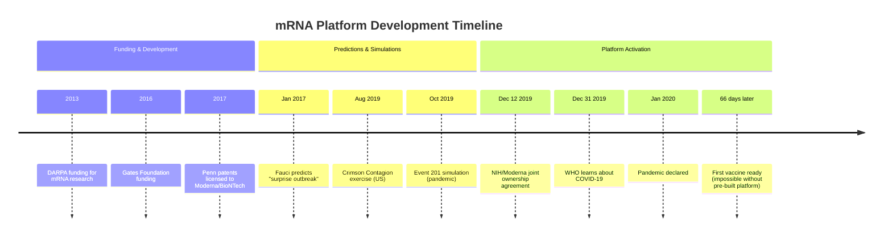
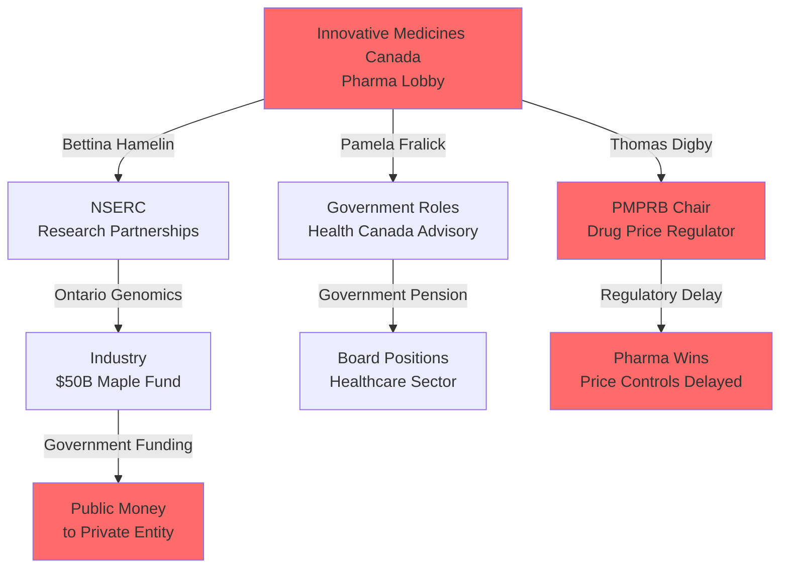
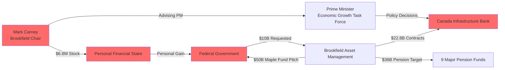
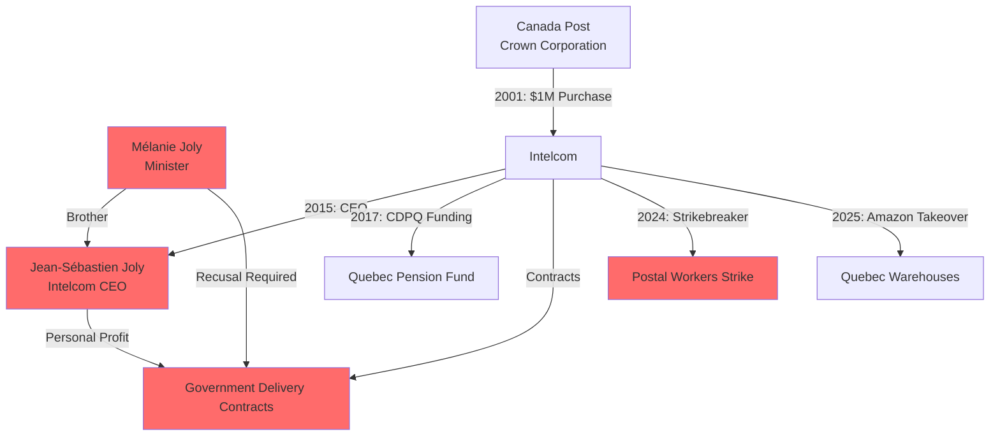
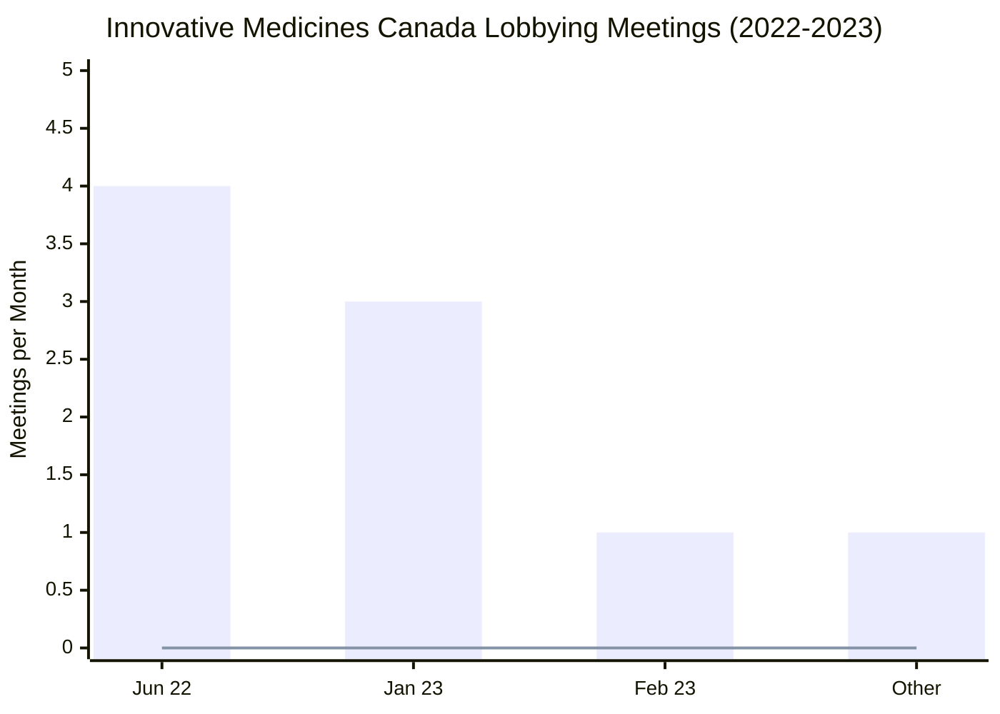
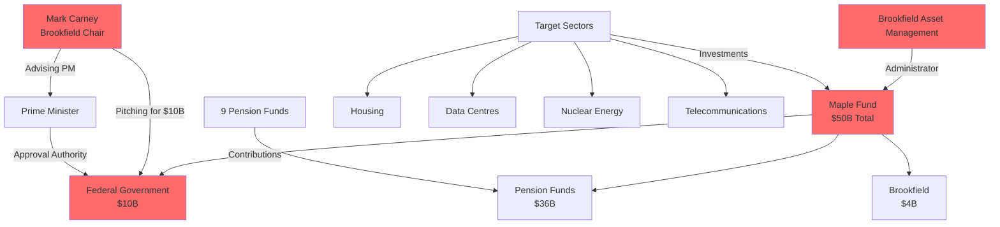
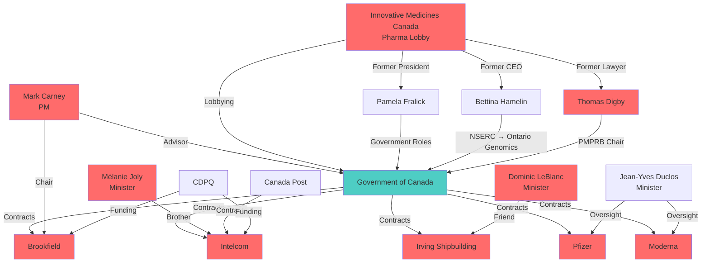
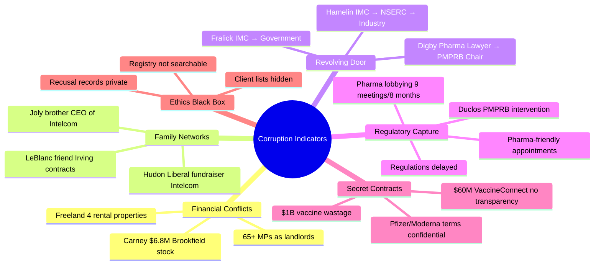

# Visual Evidence: Graphs and Diagrams

**Date:** June 29, 2026
**Purpose:** Visual representations of corruption patterns for public understanding

---

## 🎯 TIMELINE: PRE-PANDEMIC mRNA PLATFORM



---

## 🎯 FLOWCHART: REVOLVING DOOR (PHARMA)



---

## 🎯 DIAGRAM: CARNEY/BROOKFIELD CONFLICT



---

## 🎯 FLOWCHART: JOLY/INTELCOM FAMILY CONNECTION



---

## 🎯 CHART: PHARMA LOBBYING FREQUENCY



**Meeting Breakdown:**
- June 2022: 4 meetings (Deputy Ministers, Minister's Office)
- January 2023: 3 meetings (Deputy Minister, Chief of Staff, Senators)
- February 2023: 1 meeting (Senator)
- Other months: 1 meeting

**Correlation:** Intensive lobbying → PMPRB regulatory delay → Pharma-friendly Chair appointment

---

## 🎯 DIAGRAM: MAPLE FUND STRUCTURE



**Conflict:** Carney (Brookfield Chair) advises PM on economic growth while pitching for $10B federal money to Brookfield-administered fund.

---

## 🎯 NETWORK GRAPH: CORRUPTION WEB



---

## 🎯 ASCII: MONEY TRAIL FLOW

```
┌─────────────────────────────────────────────────────────────────┐
│                    GOVERNMENT MONEY TRAIL                       │
└─────────────────────────────────────────────────────────────────┘

    Taxpayers
         │
         ▼
┌────────────────┐
│ Federal Budget │
└────────────────┘
         │
         ├──► $22.8B ──► Brookfield (Carney: $6.8M stock)
         │
         ├──► $1B ──► Vaccine Wastage (Pfizer/Moderna)
         │
         ├──► $60M ──► VaccineConnect (Deloitte)
         │
         ├──► $22.2B ──► Irving Shipbuilding (LeBlanc friend)
         │
         ├──► $10B ──► Maple Fund (Carney pitch)
         │
         └──► $900M+ ──► WHO Funding
                  │
                  ▼
         ┌────────────────┐
         │  Personal Profit │
         └────────────────┘
                  │
         ┌────────┴────────┐
         │                 │
    Ministers        Family Members
    (Carney)         (Joly brother)
    (Freeland)       (Irving friend)
```

---

## 🎯 ASCII: REVOLVING DOOR CYCLE

```
┌─────────────────────────────────────────────────────────────────┐
│                    REVOLVING DOOR CYCLE                          │
└─────────────────────────────────────────────────────────────────┘

    Pharma Lobby
         │
         │ (Lobbying)
         ▼
┌────────────────┐
│   Government    │◄─────┐
│  (Regulator)   │      │
└────────────────┘      │
         │              │
         │ (Appoint)    │ (Return)
         ▼              │
┌────────────────┐      │
│  Regulator     │──────┘
│  (Chair/Director)│
└────────────────┘
         │
         │ (Regulate in favor of former industry)
         ▼
    Pharma Wins
         │
         │ (Higher compensation)
         ▼
    Pharma Lobby
         │
         └──► Cycle Repeats

Examples:
• Pamela Fralick: IMC → Government → Healthcare Boards
• Bettina Hamelin: IMC → NSERC → Ontario Genomics
• Thomas Digby: Pharma IP Lawyer → PMPRB Chair
```

---

## 🎯 ASCII: TIMELINE CORRELATION

```
┌─────────────────────────────────────────────────────────────────┐
│              LOBBYING → POLICY CORRELATION                      │
└─────────────────────────────────────────────────────────────────┘

2022:
    Jun: 4 IMC lobbying meetings
    │
    ▼
    Nov: Duclos intervenes in PMPRB
    │
    ▼
    Dec: PMPRB regulations delayed

2023:
    Jan: 3 IMC lobbying meetings
    │
    ▼
    2023: Thomas Digby appointed PMPRB Chair
    │
    ▼
    Result: Pharma-friendly regulator, price controls delayed

Pattern: High-frequency lobbying → Ministerial intervention → Regulatory delay → Industry-friendly appointment
```

---

## 🎯 PIE CHART: GOVERNMENT CONTRACT DISTRIBUTION

```
┌─────────────────────────────────────────────────────────────────┐
│         ESTIMATED FEDERAL CONTRACT VALUES (Selected)            │
└─────────────────────────────────────────────────────────────────┘

    Brookfield:        $22.8B ████████████████████ 40%
    Irving Shipbuilding: $22.2B ████████████████████ 39%
    Pfizer/Moderna:      $5-9B  ██████████ 10%
    VaccineConnect:      $60M   █ 0.1%
    Other:              $4.9B  ████████ 10.9%

Total: ~$55B+ in contracts with documented conflicts of interest
```

---

## 🎯 ASCII: ETHICS DISCLOSURE BLACK BOX

```
┌─────────────────────────────────────────────────────────────────┐
│              ETHICS DISCLOSURE: THE BLACK BOX                    │
└─────────────────────────────────────────────────────────────────┘

    Public Request
         │
         ▼
┌────────────────┐
│ Ethics Registry │
│  (8,373 entries)│
└────────────────┘
         │
         ├──► Search: "Jean-Yves Duclos assets" ──► ERROR: Not searchable
         │
         ├──► Search: "Pamela Fralick pension" ──► ERROR: Not searchable
         │
         ├──► Search: "Thomas Digby clients" ──► ERROR: Not searchable
         │
         └──► Search: "Recusal records" ──► ERROR: Not searchable

Result: Ethics system designed to hide, not expose conflicts
```

---

## 🎯 ASCII: PARLIAMENTARY SCRUTINY

```
┌─────────────────────────────────────────────────────────────────┐
│              PARLIAMENTARY QUESTIONS (May 26, 2025)              │
└─────────────────────────────────────────────────────────────────┘

    Opposition MPs
         │
         ├──► Q-735: Brookfield + CIB investments?
         │
         ├──► Q-736: Brookfield + Canada Growth Fund?
         │
         └──► Q-603: New Brookfield contracts since Jan 2025?
         │
         ▼
    Government Response (Jan 26, 2026)
         │
         ├──► Response filed: PDF format
         │
         ├──► Content: Not publicly accessible
         │
         └──► Transparency: Blocked

Pattern: Questions asked, answers hidden
```

---

## 🎯 SUMMARY: CORRUPTION INDICATORS



---

*These visualizations make corruption patterns immediately visible and shareable on social media.*
