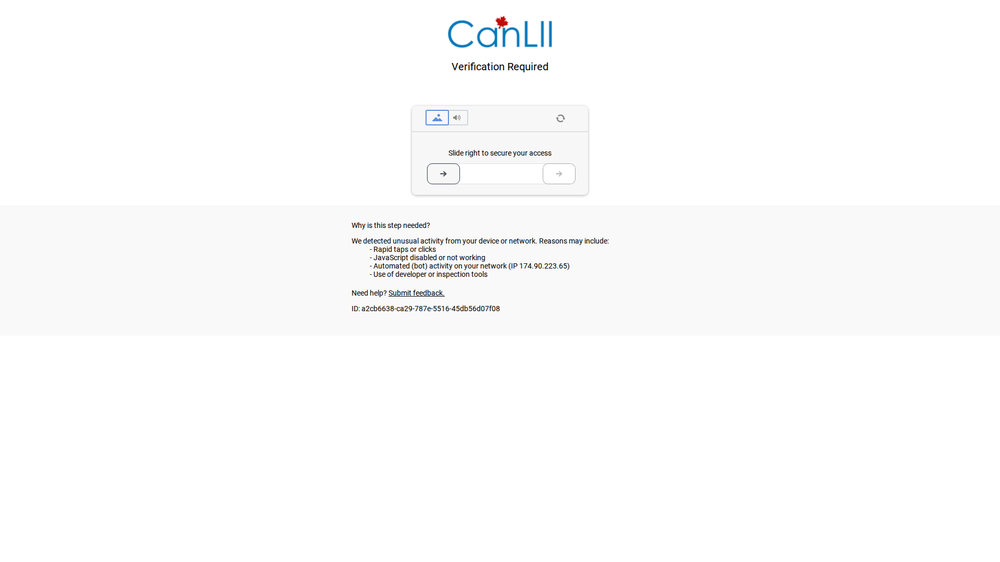
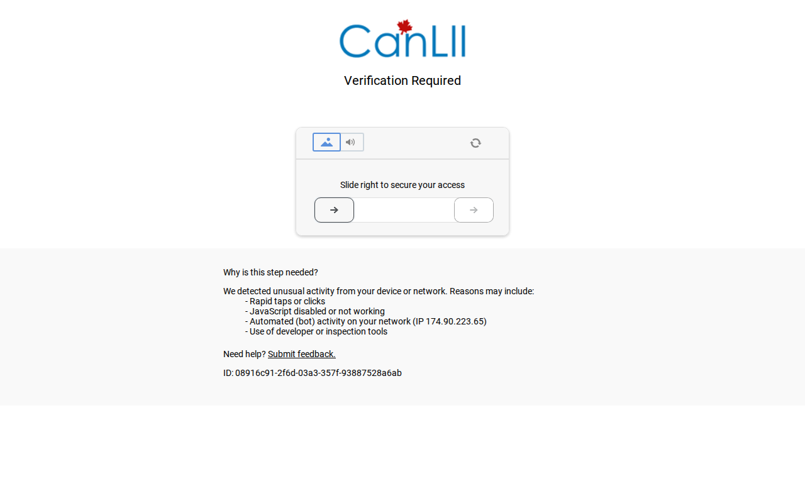
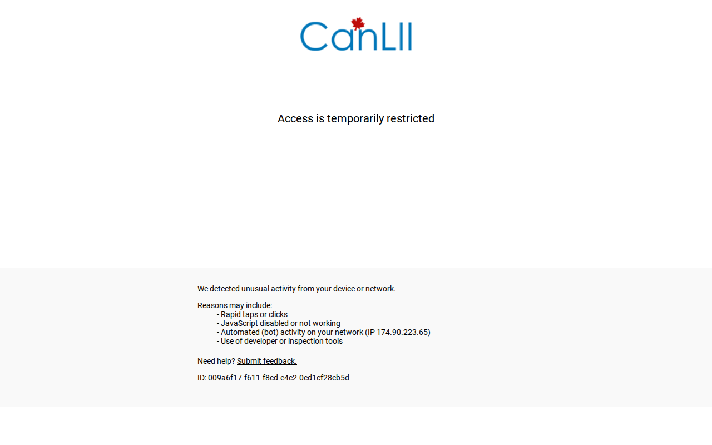

# CanLII Access Barrier — Documented Evidence Sequence

**Target:** Peterson v. College of Psychologists of Ontario, 2023 ONSC 4685  
**URL:** https://www.canlii.org/en/on/onsc/doc/2023/2023onsc4685/2023onsc4685.html  
**What it is:** A PUBLIC court decision on a Canadian's Charter s.2(b) freedom of expression challenge.  
**Database:** CanLII — Canadian Legal Information Institute. Describes itself as providing "free, online access to law." Funded by Canadian law societies.

---

## Step 1 — Initial Request: HTTP 403

First contact with CanLII returns HTTP 403. Cloudflare intercepts all requests flagged as automated.

---

## Step 2 — Cloudflare Managed Challenge: Interactive Slider CAPTCHA

**"Verification Required — Slide right to secure your access."**

Challenge type: `rt:c` (Cloudflare Managed Challenge — highest tier).  
Challenge ID: `08916c91-2f6d-03a3-357f-93887528a6ab`  
IP flagged: `174.90.223.65`  
Reasons listed: *Rapid taps or clicks / JavaScript disabled / Automated (bot) activity / Use of developer or inspection tools*

This is not a standard JS proof-of-work challenge. It is an **interactive CAPTCHA** requiring human mouse interaction to proceed. It cannot be bypassed by headless browsers, `playwright-stealth`, or `cloudscraper`.

---

## Step 3 — After Completing Slider: IP Banned Anyway

**"Access is temporarily restricted."**

After successfully locating the slider element and completing the drag interaction with human-like mouse movement, CanLII escalated to a full IP-level restriction.  
New challenge ID: `009a6f17-f611-f8cd-e4e2-0ed1cf28cb5d`

The IP was flagged at the Cloudflare account level. Completing the CAPTCHA did not restore access.

---

## Analysis

A citizen attempting to read a **public court decision** about **freedom of expression** on a **government-linked open-access legal database** is met with:
1. An automated block
2. A CAPTCHA slider
3. A permanent IP ban for attempting to pass the CAPTCHA

The court decision in question — Peterson v. CPO — concerns a Canadian's right to speak freely under Charter s.2(b). The public cannot read it without solving a CAPTCHA, and solving the CAPTCHA results in being banned.

This is the open government paradox documented in real time.

---

*Screenshots captured: 2026-06-25. Evidence items: 58, 60, 61 in Veritas vault.*
